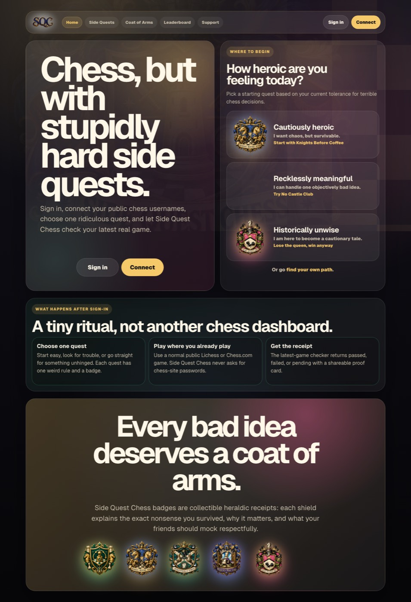
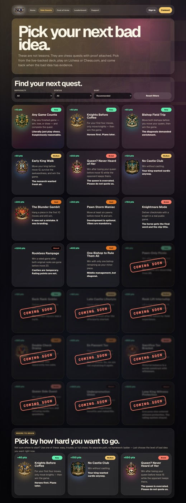
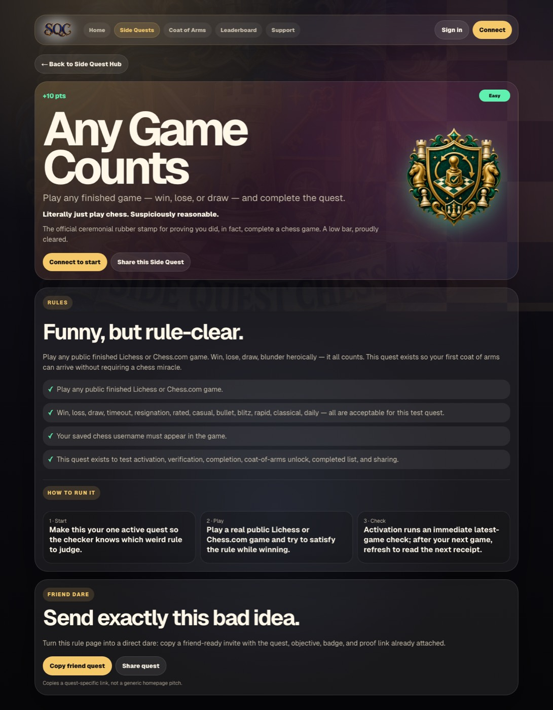
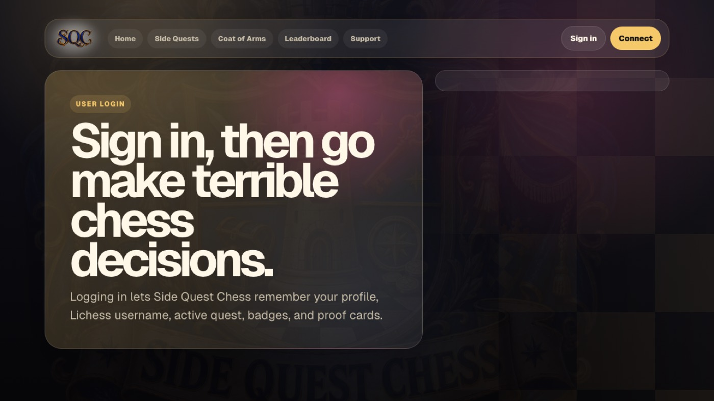

# Side Quest Chess — External Product, UX, Market & Commercial Review

**Prepared for:** Side Quest Chess / Andreas Nordenadler  
**Prepared by:** Sam, acting as external product consultant  
**Date:** 2026-05-06  
**Review scope:** End-user usability, attractiveness, design, marketability, monetization, competitive context, SWOT, legal/commercial risks, and prioritized recommendations.  
**Product reviewed:** `https://sidequestchess.com`

---

## 1. Executive Summary

Side Quest Chess has a genuinely differentiated product idea: it turns ordinary online chess games into playful, verifiable “side quests” with collectible heraldic rewards. This is a strong niche because it does **not** try to out-teach Chess.com, out-free Lichess, or out-course Chessable. Instead, it creates a social ritual around chess: “do something ridiculous, prove it, unlock a coat of arms, share the receipt.”

The product’s strongest assets are its **brand voice**, **coat-of-arms reward system**, and **shareable completion ritual**. These give Side Quest Chess a memorable identity in a crowded chess market that is otherwise dominated by improvement, ratings, puzzles, engines, and course libraries. The opportunity is to position SQC as the “fun challenge layer” that sits on top of Lichess and Chess.com rather than replacing them.

However, the product is still early. The logged-out homepage is compelling, but the full funnel needs more commercial clarity: who exactly is this for, why should they sign in today, what happens in the first five minutes, and why would they come back weekly? The logged-in account area is moving in the right direction, especially after the simplified completed Side Quests list, but the experience should become even more task-led: **connect account → pick quest → play → verify → share → pick next quest**.

Commercially, SQC should avoid monetizing core verification too early. The best near-term path is a free, viral, collectible base product with optional paid cosmetics, seasonal quest packs, supporter status, clubs/groups, and eventually creator/streamer tools. The main strategic risk is that the product becomes perceived as a novelty rather than a durable habit. The main legal/commercial risks are trademark/brand proximity to Chess.com/Lichess, public-game data handling, user-generated sharing, and prize/competition rules if rewards ever gain monetary value.

**Overall assessment:** promising, distinctive, and marketable — but it should focus its next phase on onboarding clarity, repeat use loops, share virality, mobile polish, and a monetization model that preserves the joke rather than taxing it.

---

## 2. Methodology & Evidence

### Reviewed live as a signed-out visitor
- Homepage: `https://sidequestchess.com`
- Side Quests page: `https://sidequestchess.com/challenges`
- Quest detail: `https://sidequestchess.com/challenges/finish-any-game`
- Signed-out account redirect/sign-in gate: `https://sidequestchess.com/account`

### Reviewed logged-in experience
The logged-in experience was reviewed through:
1. Current source/product implementation for `/account`, `/result`, challenge detail, proof sharing, and completed-quest history.
2. Existing authenticated render artifacts from prior SQC smoke/review work.
3. Current account-page product structure after the removal of `/proof-log` and addition of the simplified completed Side Quests list.

**Important limitation:** I did not mutate a real production account or create a new external login session during this review. The signed-out experience was freshly tested live. The logged-in review is based on current implementation plus existing authenticated artifacts. For a final investor/customer-readiness audit, I recommend a clean production test account run from first login through completed quest sharing.

### Screenshots captured / referenced
- `screenshots-web/signed-out-home.jpg`
- `screenshots-web/signed-out-side-quests.jpg`
- `screenshots-web/signed-out-any-game-counts.jpg`
- `screenshots-web/account-signed-out-auth-gate.jpg`
- `screenshots-web/logged-in-my-side-quests-existing.jpg` *(authenticated artifact; useful for dashboard review, not guaranteed to reflect every latest visual change)*

---

## 3. Product Positioning

### What SQC is today
Side Quest Chess is a lightweight challenge layer for online chess. Users sign in, connect public chess usernames, choose a strange chess objective, play on Lichess or Chess.com, then return to receive a verification result and collectible coat of arms.

### Best positioning statement
> **Side Quest Chess turns normal online chess games into ridiculous, verifiable quests with collectible coats of arms.**

This is stronger than positioning the product as a training app. It is not primarily about instruction. It is about motivation, humor, collecting, identity, and shareable proof.

### Category recommendation
SQC should define itself as a **social chess challenge platform** or **collectible chess quest layer**, not a chess trainer.

Suggested category language:
- “Chess challenges with proof.”
- “A quest layer for your Lichess and Chess.com games.”
- “Collect coats of arms for surviving bad chess ideas.”
- “Like achievements, but more embarrassing and shareable.”

---

## 4. End-User Usability Review

### 4.1 Signed-out homepage

**What works well**
- The central promise is clear and fun: “Chess, but with stupidly hard side quests.”
- The tone is distinctive and memorable.
- The fantasy/heraldic visual system creates immediate differentiation.
- The flow is mostly understandable: browse quests, sign in, connect accounts, play, verify.
- “No chess-site passwords” style reassurance is valuable and should be repeated near sign-in/connect moments.

**What weakens conversion**
- The homepage offers multiple competing first actions: browse quests, connect, sign in, pick heroism level. This is not wrong, but the highest-converting path should be unmistakable.
- “Connect” can be ambiguous to new users. It could mean connect wallet, connect Google, connect chess account, or sign in.
- The fantasy language is charming, but users still need simple operational clarity above the fold.

**Recommendation**
Make the primary above-the-fold CTA one of:
- **Start your first Side Quest**
- **Sign in to start a Side Quest**
- **Pick your first quest**

Then use secondary copy to explain: “Connect only your public Lichess or Chess.com username. No chess-site password.”

### 4.2 Signed-out Side Quests browsing

**What works well**
- Browsing quests before sign-in is the right choice. It lets visitors understand the joke before committing.
- The quest categories and difficulty range create a sense of depth.
- The coat-of-arms art makes the catalog feel more collectible than a normal checklist.

**Issues**
- Some cards can feel like content rather than actions. Users should instantly know whether a card is clickable and what happens next.
- Coming-soon cards create anticipation, but too many unavailable items can make the product feel unfinished.
- The product should clarify whether a visitor can “preview,” “start,” or “save” a quest before signing in.

**Recommendation**
Give every live quest card a clear action label:
- “View rules” for signed-out users.
- “Start this quest” for signed-in users.
- “Coming soon” should be visually quieter than live quests.

### 4.3 Quest detail page

**What works well**
- The beginner/test quest is a smart onboarding tool because it lets users complete the full loop without needing a chess miracle.
- The quest identity and badge art support the collectible fantasy.
- The verification concept is easier to trust when users see exactly what counts.

**Issues**
- For a first-time visitor, “what do I do right now?” should be even more explicit.
- If signed out, the detail page should use a clear conversion CTA: “Sign in to start this quest.”
- If signed in but not connected, the page should say: “Connect chess account first.”
- If signed in and connected, it should say: “Start quest.”

**Recommendation**
Use state-specific CTAs and avoid making every user infer their next step.

### 4.4 Sign-in/account gate

**What works well**
- Redirecting `/account` to sign-in is expected.
- The account gate keeps private progress out of public view.

**Issues**
- The sign-in moment is a trust bottleneck. Users are being asked to authenticate before they have received value.
- The sign-in screen should reinforce the promise and privacy model.

**Recommendation**
Near sign-in, add a concise reassurance block:
- “No chess-site passwords.”
- “We only use public games from your chess username.”
- “You can browse quests before signing in.”

### 4.5 Logged-in My Side Quests

**What works well**
- “My Side Quests” is a strong label. It is clearer and warmer than “Proof Log” or “Quest Log.”
- The simplified completed Side Quests list is directionally correct. Users need a trophy shelf, not an internal audit table.
- Showing coat of arms + quest name + completion date is exactly the right level of detail for history.
- Current Quest and Connected Accounts are the right dashboard primitives.

**Issues**
- The logged-in dashboard should be relentlessly task-led. For a new user, the page should answer one question: “What should I do next?”
- The account page currently contains several useful modules, but the hierarchy can still become busy once the user has progress, accounts, current quest, points, proofs, and coats.
- Points are visible, but their meaning is not yet commercially or socially obvious.

**Recommendation**
Use a single “Next step” module at the top of the logged-in experience:
1. If no chess account: **Connect chess account**.
2. If no active quest: **Pick a Side Quest**.
3. If active quest incomplete: **Play a public game, then verify**.
4. If active quest completed: **Share proof / Pick next quest**.

Then put trophy/history content beneath it.

---

## 5. Attractiveness & Design Assessment

### Strengths
- The visual identity is unusually strong for an early product.
- The coat-of-arms system creates emotional ownership.
- The dark, ornate, chess/fantasy direction fits the product’s absurd challenge premise.
- Copywriting has a confident voice and avoids generic SaaS blandness.

### Risks
- Some surfaces are visually dense. Dark panels, patterned backgrounds, ornate badges, long copy, filters, and multiple CTAs can compete for attention.
- Large hero sections can push interaction too far down the page.
- The badge art is the product’s visual anchor; any broken image, weak crop, or inconsistent treatment disproportionately damages perceived quality.

### Design recommendation
Adopt a simple hierarchy rule:
- **One hero message.**
- **One primary action.**
- **One collectible visual.**
- Everything else supports those three.

### Brand tone recommendation
The current tone is a competitive advantage. Keep it. But pair the jokes with plain-language UX labels. Example:
- Fun: “Every bad idea deserves a coat of arms.”
- Plain: “Complete quests by playing public Lichess or Chess.com games.”

---

## 6. Market Overview

The online chess market remains large and active, with major platforms offering play, puzzles, analysis, lessons, coaching, and courses. A 2026 market estimate from Business Research Insights places the global online chess instruction and play market at approximately **USD 0.27B in 2026**, projected to reach **USD 0.86B by 2035**, with a reported CAGR of **~13.13%**. The same source identifies gamified learning as a major trend, with more than half of platforms incorporating gamified engagement mechanics.

Key market facts and directional signals:
- Chess.com monetizes through premium subscriptions around game review, puzzles, lessons, coach features, and ad-free play.
- Lichess is a large, free/open-source chess platform funded by donations/patrons and reports more than five million games played daily.
- Chessable focuses on course-based learning and spaced repetition.
- Aimchess focuses on analytics from users’ games and personalized training.
- The market is mature in core chess play/training, but less mature in playful social overlays and collectible achievement layers.

### Market implication for SQC
SQC should not compete head-on with the incumbents. It should integrate culturally with them. The winning strategy is to become something users do **because they already play chess elsewhere**.

---

## 7. Competitive Landscape

| Competitor / Category | Core value | Monetization | SQC opportunity |
|---|---:|---:|---|
| Chess.com | Play, puzzles, lessons, game review, ratings, community | Premium subscription, ads | SQC can be the playful challenge/share layer Chess.com does not prioritize. |
| Lichess | Free play, analysis, studies, community | Donations/patrons | SQC can add collectibles and social proof without competing with Lichess' free ethos. |
| Chessable | Structured learning, openings, spaced repetition | Course sales, Pro subscription | SQC should avoid course depth; instead be lightweight, humorous, and habit-forming. |
| Aimchess | Personalized analytics and training from games | Subscription/freemium | SQC can use game data for fun achievement verification rather than improvement analytics. |
| Puzzle/gamified apps | Quick dopamine, streaks, leaderboards | Ads/subscription/IAP | SQC can combine dopamine with real-game proof, which is more social and authentic. |
| Discord/Reddit chess communities | Memes, challenges, bragging, clips | Indirect/community | SQC can formalize community dares into verifiable share artifacts. |

### Competitive whitespace
The clearest whitespace is **verifiable, shareable, absurd chess achievements**. Existing chess platforms already have achievements, but they are generally internal badges. SQC can win by making the achievement itself the product and making the proof socially portable.

---

## 8. Marketability

### What is marketable today
- “Stupidly hard chess side quests” is a hook.
- The coat-of-arms rewards are visually shareable.
- Quest names and proof receipts can become social content.
- The product works with existing chess habits instead of requiring users to move platforms.

### Best early audiences
1. **Casual/intermediate online chess players** who play regularly but are bored with rating grind.
2. **Chess streamers and content creators** who need funny challenge content.
3. **Chess Discord communities** looking for weekly events.
4. **Adult improvers** who want fun constraints, not another lesson plan.
5. **School/club groups** if moderation and age handling are tightened.

### Messaging angles
- “Make your next chess game weird.”
- “Win a coat of arms for surviving bad ideas.”
- “Chess achievements your friends can actually verify.”
- “A weekly chess dare, with proof.”
- “Turn your Lichess/Chess.com games into quests.”

### Viral loops
- Shareable proof scrolls.
- Quest completion images.
- “I dare you to beat this quest” links.
- Seasonal quest drops.
- Community leaderboards.
- Streamer challenge packs.

---

## 9. Monetization Potential

### Principle
Do not monetize the first successful completion loop too early. The product first needs habit, trust, and share velocity. Monetization should feel like buying into the joke, not paying a toll.

### Recommended monetization ladder

#### Phase 1 — Free viral base
- Free account.
- Free public-game verification.
- Free basic quest catalog.
- Free completed proof sharing.

Goal: maximize adoption and shareable artifacts.

#### Phase 2 — Supporter/cosmetic monetization
Potential paid features:
- Premium coat-of-arms frames.
- Alternate badge art styles.
- Custom player heraldry page.
- Supporter seal on proof scrolls.
- Seasonal cosmetic packs.
- Profile customization.

This fits the product because SQC is identity/collection-driven.

#### Phase 3 — Quest packs and seasons
Potential products:
- Seasonal quest pack: monthly themed challenges.
- “Streamer dare pack.”
- “Beginner chaos pack.”
- “Opening sins pack.”
- Limited-time coats of arms.

This supports recurring revenue without blocking the core loop.

#### Phase 4 — Clubs, groups, and creator tools
Potential paid tiers:
- Private club leaderboards.
- Custom community quests.
- Team/club challenge pages.
- Streamer overlay/share kit.
- Tournament/league mode.

This may be the most commercially credible B2B/B2Creator path.

#### Phase 5 — Sponsorship and partnerships
Potential options:
- Sponsored seasonal quests.
- Chess creator collaborations.
- Club/school challenge campaigns.
- Merchandise based on coats of arms.

### Monetization risks
- Charging for verification could reduce trust and virality.
- Paywalling too many quests could make the product feel small.
- Cosmetic monetization requires consistently excellent art direction.
- If prizes or real-money rewards are introduced, legal complexity increases sharply.

---

## 10. SWOT Analysis

### Strengths
- Distinctive concept in a crowded market.
- Strong brand voice and visual identity.
- Works on top of existing chess platforms.
- Shareable proof mechanics create natural marketing content.
- Collectible coats of arms create emotional ownership and retention potential.
- Humorous challenge design is streamer/social friendly.

### Weaknesses
- Early product still needs onboarding polish.
- Value proposition may be misunderstood as “just badges” unless the social ritual is emphasized.
- Depends on third-party public chess data availability and reliability.
- Logged-in flow can become module-heavy without a strong next-action hierarchy.
- The product may currently appeal more to novelty seekers than durable weekly users.

### Opportunities
- Seasonal quest drops.
- Community/club challenge leagues.
- Creator packs and streamer integrations.
- Social sharing growth via proof scrolls.
- Paid cosmetics and personalization.
- Partnerships with chess clubs, schools, online communities, and creators.
- “Challenge of the week” newsletter/social loop.

### Threats
- Chess.com or Lichess could introduce stronger native challenge/achievement features.
- Public API/data changes could break verification.
- Low retention if quests are too few, too hard, or not socially reinforced.
- Legal/platform risk if brand language implies official affiliation.
- Users may share offensive/custom content if future custom quests are introduced.
- If monetization is too aggressive, the product may lose its playful credibility.

---

## 11. Legal & Risk Considerations

**Disclaimer:** This section is product/legal risk analysis, not legal advice. A qualified lawyer should review before launch, monetization, contests, or youth-focused distribution.

### 11.1 Platform affiliation and trademarks
SQC references Lichess and Chess.com as supported sources of public games. That is commercially sensible, but the product should avoid implying partnership, endorsement, or official integration unless such agreements exist.

Recommendations:
- Add wording such as: “Side Quest Chess is not affiliated with Chess.com or Lichess.”
- Use text references conservatively.
- Avoid using third-party logos unless permission is clear.

### 11.2 Public game data and privacy
SQC uses public chess usernames and public game records. That is lower risk than credential access, but users still need clear disclosure.

Recommendations:
- State plainly: “We use your public chess username to check public games.”
- Avoid collecting chess-site passwords.
- Provide a way to disconnect or change usernames.
- Keep proof pages share-safe and avoid exposing unnecessary account metadata.

### 11.3 User accounts and data retention
If SQC stores quest attempts, profile data, points, and completed proofs, it should have a privacy policy that describes:
- What account data is stored.
- What chess usernames are stored.
- What proof data is stored.
- Whether proof pages are public/shareable.
- How users can delete data.

### 11.4 Children / youth chess market
Chess has a large youth audience. If SQC intentionally markets to children or schools, additional privacy and consent rules may apply depending on jurisdiction.

Recommendation:
- Until legal readiness is stronger, position SQC primarily for general/adult chess users and communities.

### 11.5 Contests, prizes, and gambling-like concerns
The current product awards points/coats of arms with no monetary value. That is relatively low risk. If prizes, paid competitions, wagering, or cash-equivalent rewards are added, legal complexity increases.

Recommendation:
- Keep points non-monetary.
- Avoid prize pools until contest rules and jurisdictional compliance are reviewed.

### 11.6 User-generated content and moderation
If custom quests, community names, profile bios, or public proof captions expand, moderation risk grows.

Recommendation:
- Add content reporting and moderation rules before enabling broad custom/public content.

---

## 12. Strategic Recommendations

### Priority 1 — Tighten first-run onboarding
Create a clean first-session journey:
1. Browse a small set of live quests.
2. Sign in to start.
3. Connect public chess username.
4. Pick “Any Game Counts.”
5. Play or use latest public game.
6. Verify.
7. See coat of arms.
8. Share.
9. Pick next quest.

This journey should be measurable and visible in the UI.

### Priority 2 — Make the logged-in page a next-action dashboard
My Side Quests should answer “what now?” before showing collection/history.

Recommended top module logic:
- No username → Connect chess account.
- Username but no active quest → Pick a Side Quest.
- Active quest incomplete → Play and verify.
- Completed active quest → Share proof and pick next.

### Priority 3 — Clarify conversion CTAs
Use state-aware CTA labels:
- Signed out: “Sign in to start this quest.”
- Signed in, not connected: “Connect chess account.”
- Signed in, connected: “Start this quest.”
- Completed: “View victory proof.”

### Priority 4 — Reduce visual density where decisions happen
Keep the ornate style for reward moments, but make decision surfaces simpler:
- Quest selection.
- Account connection.
- Verification status.
- Error/failure states.

### Priority 5 — Build repeat-use mechanics
Add a weekly cadence:
- Quest of the Week.
- Seasonal quest board.
- Streaks for weekly completions.
- New coat drops.
- “Dare a friend” links.

### Priority 6 — Prepare monetization around identity and community
Do not paywall the core. Start with optional identity/cosmetic monetization:
- Supporter cosmetics.
- Premium heraldry customization.
- Seasonal packs.
- Community/club dashboards.
- Creator challenge packs.

### Priority 7 — Add basic legal/commercial hygiene
Before broader launch:
- Privacy policy.
- Terms of use.
- Third-party non-affiliation notice.
- Data deletion path.
- Public proof sharing explanation.

---

## 13. Recommended Roadmap: 30 / 60 / 90 Days

### Next 30 days — Conversion and trust
- Add state-aware CTAs across quest detail and homepage.
- Add sign-in/connect reassurance copy.
- Make My Side Quests top module purely next-action driven.
- Add a clean production test account and run a full first-user loop weekly.
- Create a short landing-page section showing an example completed proof scroll.

### 31–60 days — Retention and sharing
- Add Quest of the Week.
- Add “Pick next quest” flow after completion.
- Add friend/share challenge links.
- Add lightweight profile/trophy page for completed coats.
- Improve mobile layout for quest browsing and proof sharing.

### 61–90 days — Commercial experiments
- Launch supporter cosmetic tier.
- Test seasonal quest packs.
- Pilot private group leaderboard with a small chess Discord/community.
- Create one streamer-friendly quest pack and outreach list.
- Add analytics for activation, completion, share, and repeat quest rates.

---

## 14. KPIs to Track

### Activation
- Visitor → sign-in conversion.
- Sign-in → connected chess account conversion.
- Connected account → first quest started.
- First quest started → first verification.
- First verification → first completion.

### Engagement
- Quests completed per user.
- Weekly active questers.
- Repeat quest completion rate.
- Quest abandonment rate.
- Completion share rate.

### Virality
- Shares per completed quest.
- Clicks per shared proof.
- New users from shared proof links.
- Dare/friend invite conversion.

### Monetization readiness
- Supporter intent clicks.
- Cosmetic preview interactions.
- Seasonal quest pack interest.
- Club/group feature requests.

---

## 15. Final Assessment

Side Quest Chess is not yet a polished commercial product, but it is already more distinctive than many early chess tools. The product should lean harder into what makes it special: **absurd quests, verifiable proof, collectible heraldry, and shareable chess humiliation/glory**.

The most important next step is not adding more features. It is tightening the first complete user journey until a new visitor can understand, start, complete, and share a quest with almost no explanation. Once that loop is smooth, SQC has credible paths into creator marketing, community challenges, cosmetics, and seasonal recurring engagement.

If executed carefully, SQC can occupy a defensible niche as the playful social achievement layer for online chess.

---

## Appendix A — Source Notes

External market/competitor references reviewed:
- Chess.com membership page: premium value centered on game review, puzzles, lessons, coach practice, and no ads.
- Lichess about page: free/open-source chess server, volunteer/donation-supported, reports more than five million games played daily.
- Chessable homepage/FAQ: spaced repetition and MoveTrainer-based chess course learning.
- Aimchess homepage: personalized analytics and training built from users’ games.
- Business Research Insights market report: online chess instruction/play market estimated at USD 0.27B in 2026, projected USD 0.86B by 2035, CAGR ~13.13%; gamification and AI-assisted analysis highlighted as market trends.

Internal/product evidence reviewed:
- Live signed-out production pages.
- Current `/account` implementation after completed Side Quests list update.
- Existing authenticated render artifacts from SQC smoke/review work.
- Current SQC source for challenge catalog, result/proof flow, share behavior, and account dashboard structure.
